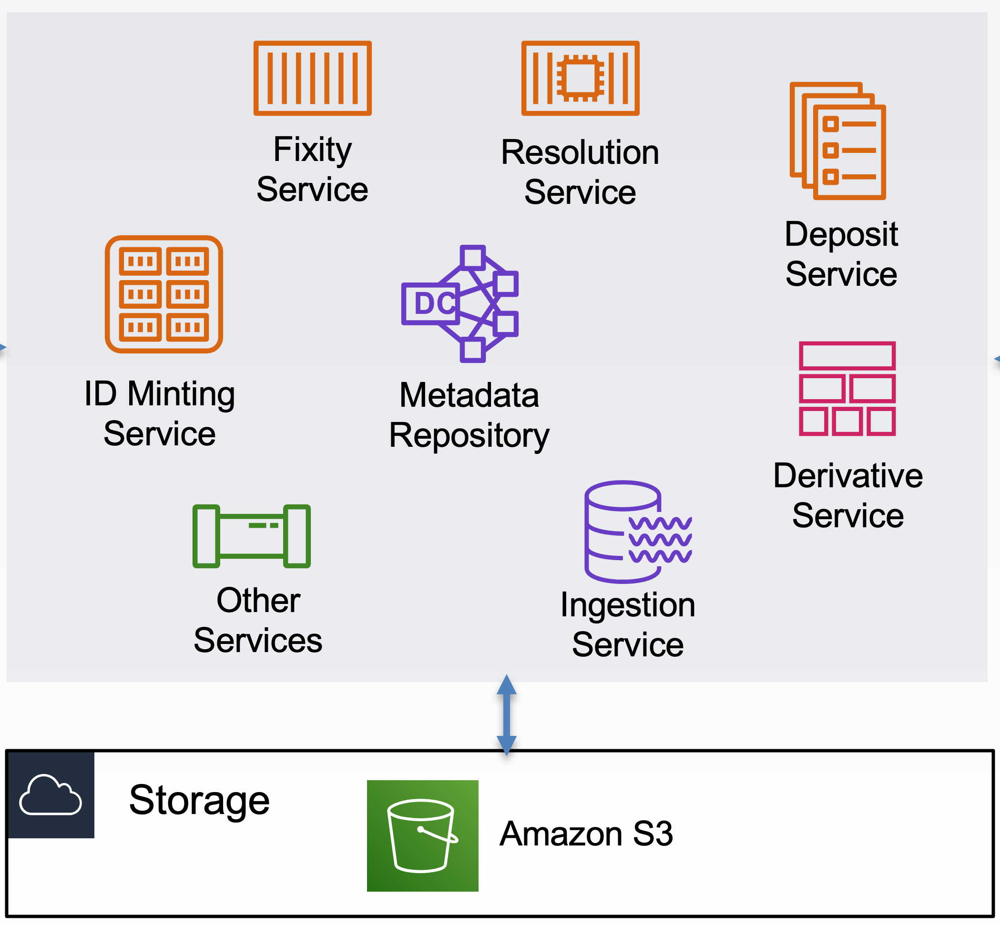

# DLPservices

## VTDLP Services overview



This CloudFormation currently deploys ID Minting service and Resolution service. 
* [ID Minting service](https://github.com/vt-digital-libraries-platform/mint)
* [Resolution service](https://github.com/vt-digital-libraries-platform/resolution-service)

You can use two different methods to deploy VTDLP Services. The first method is using CloudFormation stack and the second method is using SAM CLI.

### Deploy VTDLP Services using CloudFormation stack
#### Step 1: Launch CloudFormation stack
[](https://console.aws.amazon.com/cloudformation/home?region=us-east-1#/stacks/new?&templateURL=https://vtdlp-dev-cf.s3.amazonaws.com/793604d715ed316eb0cc49edf5c0f326.template)

Click *Next* to continue

#### Step 2: Specify stack details

* <b>Stack name</b>: Stack name can include letters (A-Z and a-z), numbers (0-9), and dashes (-).

* <b>Parameters</b>: Parameters are defined in your template and allow you to input custom values when you create or update a stack.

| Name | Description | Note |
|:---  |:------------|:------------|
| NSTableName | a DynamoDB table name | **Required** |
| NOIDNAA | The character string equivalent for the NAAN; for example, 13960 corresponds to the NAA, "archive.org". e.g. 53696 | **Required** |
| NOIDScheme | ARK (Archival Resource Key) identifier scheme that the noid utility was partly created to support. E.g. `ark:/` | **Required** |
| NOIDTemplate | a valid string. e.g. eeddeede | **Required** |
| Image404 | a valid URL. e.g. http://404.Image.png | **Required** |
| REGION | a valid AWS region. e.g. us-east-1  | **Required** |

#### Step 3: Configure stack options
Leave it as is and click **Next**

#### Step 4: Review
Make sure all checkboxes under Capabilities section are **CHECKED**

Click *Create stack*

#### Step 5: Finish
After cloudformation is deployed successfully, you can see `ID Minting service` and `Resolution service` information in the `Resources` tab.


### Deploy VTDLP Services using SAM CLI (For advanced users)

To use the SAM CLI, you need the following tools.

* SAM CLI - [Install the SAM CLI](https://docs.aws.amazon.com/serverless-application-model/latest/developerguide/serverless-sam-cli-install.html)
* [Python 3 installed](https://www.python.org/downloads/)
* Docker - [Install Docker community edition](https://hub.docker.com/search/?type=edition&offering=community)

To build and deploy your application for the first time, run the following in your shell:

```bash
sam build --use-container
```

Above command will build the source of the application. The SAM CLI installs dependencies defined in `requirements.txt`, creates a deployment package, and saves it in the `.aws-sam/build` folder.

To package the application, run the following in your shell:
```bash
sam package --output-template-file packaged.yaml --s3-bucket BUCKETNAME
```
Above command will package the application and upload it to the S3 bucket you specified.

Run the following in your shell to deploy the application to AWS:
```bash
sam deploy --template-file packaged.yaml --stack-name STACKNAME --s3-bucket BUCKETNAME --parameter-overrides 'NSTableName=DDBTableName Region=us-east-1 Image404=https://images/404.jpg' --capabilities CAPABILITY_IAM CAPABILITY_AUTO_EXPAND --region us-east-1
```

The above command will package and deploy your application to AWS, with a series of prompts:

- **Stack Name** (STACKNAME): (Required) The name of the AWS CloudFormation stack that you're deploying to. If you specify an existing stack, the command updates the stack. If you specify a new stack, the command creates it. This should be unique to your account and region, and a good starting point would be something matching your project name. Stack name can include letters (A-Z and a-z), numbers (0-9), and dashes (-).
- **S3 Bucket** (BUCKETNAME): (Required) An Amazon S3 bucket name where this command uploads your AWS CloudFormation template. S3 bucket name is globally unique, and the namespace is shared by all AWS accounts. See [Bucket naming rules](https://docs.aws.amazon.com/AmazonS3/latest/userguide/bucketnamingrules.html). This S3 bucket should be already exist and you have the permission to upload files to it.
- **Parameter Overrides**: A string that contains AWS CloudFormation parameter overrides encoded as key-value pairs. For example, ParameterKey=ParameterValue NSTableName=DDBTableName.

    | Name | Description | Note |
    |:---  |:------------|:------------|
    | NSTableName | a DynamoDB table name | **Required** |
    | NOIDNAA | The character string equivalent for the NAAN; for example, 13960 corresponds to the NAA, "archive.org". e.g. 53696 | **Required** |
    | NOIDScheme | ARK (Archival Resource Key) identifier scheme that the noid utility was partly created to support. E.g. `ark:/` | **Required** |
    | NOIDTemplate | a valid string. e.g. eeddeede | **Required** |
    | Image404 | a valid URL. e.g. http://404.Image.png | **Required** |
    | REGION | a valid AWS region. e.g. us-east-1  | **Required** |

- **Allow SAM CLI IAM role creation**: Many AWS SAM templates, including this example, create AWS IAM roles required for the AWS Lambda function(s) included to access AWS services. By default, these are scoped down to minimum required permissions. To deploy an AWS CloudFormation stack which creates or modified IAM roles, the `CAPABILITY_IAM` and `CAPABILITY_AUTO_EXPAND` value for `capabilities` must be provided. If permission isn't provided through this prompt, to deploy this example you must explicitly pass `--capabilities CAPABILITY_IAM CAPABILITY_AUTO_EXPAND` to the `sam deploy` command. [Learn more](https://docs.amazonaws.cn/en_us/serverlessrepo/latest/devguide/acknowledging-application-capabilities.html).
- **AWS Region**: The AWS region you want to deploy your app to.

After cloudformation is deployed successfully, you can see `ID Minting service` and `Resolution service` information in the `Resources` tab.

